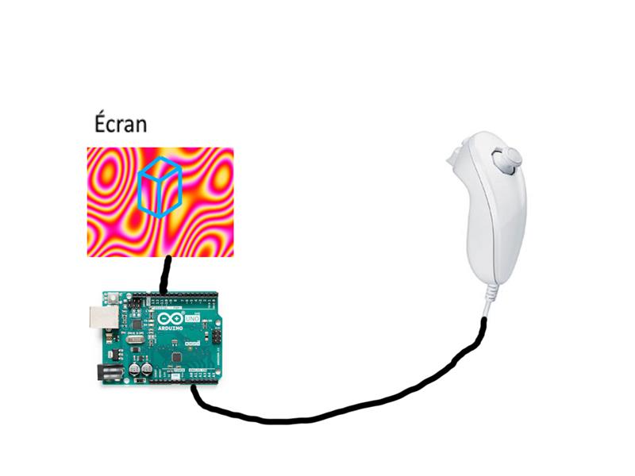
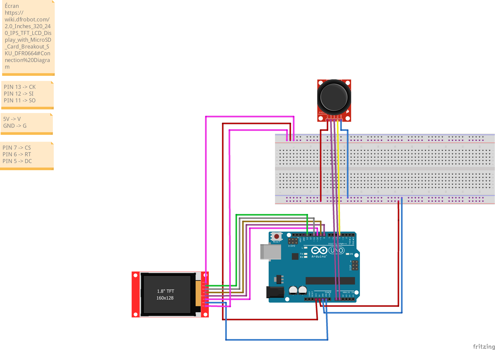

# Intro

This is an Arduino Project made during the class "IoT" taught at [HEIG-VD](https://heig-vd.ch/) for Media Engineer.

The purpose of the project was to do an Interactive [Demoscene](https://fr.wikipedia.org/wiki/Sc%C3%A8ne_d%C3%A9mo), where the user can play with a 3D cube over a psychedelic background.

# Mathematical concepts

Some mathematical concepts had to be learned in order to comprehend how you get from 3d to 2d. Thanks to [Tsoding Video | One Formula That Demystifies 3D Graphics](https://www.youtube.com/watch?v=qjWkNZ0SXfo&t=531s), the project was easy to achieve.

To go further, but it isn't necessary... Check on Geometry, Vectors, Scalar Multiplication and Weak Projection.

# Setting up the project
## Components

| Name                    | Type            |
| ---------------------- | --------------- |
| Joystick               | Analog          |
| 1x Potentiometer       | Analog          |
| Arduino Uno Rev3       | Microcontroller |
| Screen 1.44" 128x128px | Screen                |

## Wiring

Made with [Fritzing](https://fritzing.org/).

