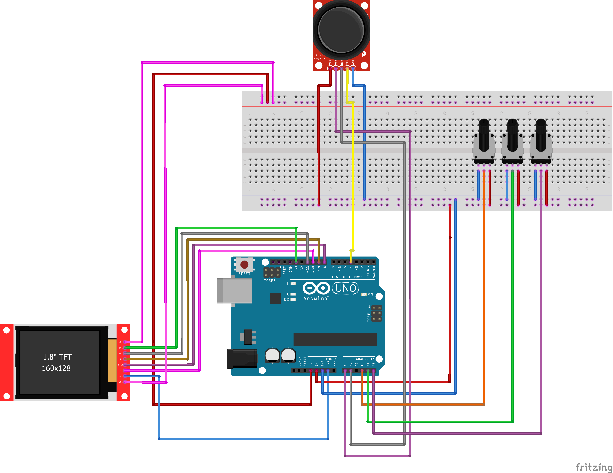

# Intro

This is an Arduino Project made during the class "IoT" taught at [HEIG-VD](https://heig-vd.ch/) for Media Engineer.

The purpose of the project was to do Interactive [Demoscenes](https://fr.wikipedia.org/wiki/Sc%C3%A8ne_d%C3%A9mo), where the user can play with a 3D Object and experiment with the Plasma Effect.

# Video

[](https://youtu.be/8QBSQZ1M7VE)

# Mathematical concepts

Some mathematical concepts had to be learned in order to comprehend how you get from 3d to 2d. Thanks to [Tsoding Video | One Formula That Demystifies 3D Graphics](https://www.youtube.com/watch?v=qjWkNZ0SXfo&t=531s), the project was easy to achieve.

To go further, but it isn't necessary... Check on Geometry, Vectors, Scalar Multiplication and Weak Projection.

# Setting up the project
## Components

| Name                    | Type            |
| ---------------------- | --------------- |
| Joystick               | Analog          |
| 3x Potentiometer       | Analog          |
| Arduino Uno Rev3       | Microcontroller |
| Screen 1.44" 128x128px | Screen                |
| Enough wires |- | 

## Wiring

Made with [Fritzing](https://fritzing.org/).



## Clone this repository

Go to your Arduino project folder, and clone the repository

```
git clone https://github.com/funky-shrimp/IoT-Interactive_Demoscene.git
```

Or [download the zip file](https://github.com/funky-shrimp/IoT-Interactive_Demoscene/archive/refs/heads/main.zip) and extract the folder **interactive_demo** into your Arduino project folder *(...\Arduino\interactive_demo)*.

# Messing around

>Press on Joystick button to switch between Demos

### 3d Object

The default demo shown when starting is the cube. You can control its rotation on X and Y axis with the Joystick.

You can switch to the Pyramid object by increasing the first potentiometer. There will be some leftovers of the cube frame, you can wipe them by playing rotating the Pyramid.

### Plasma

You can switch on different colors presets with Joystick Direction :
- Fire palette -> UP
- Ocean palette -> DOWN
- Acid palette -> LEFT
- Psychedelic palette -> RIGHT

Everytime you choose a preset, the direction of the plasma effect is randomized.

Then you can mess around with those presets by changing the speed (first potentiometer), resolution (second potentiometer) and color intensity (third potentiometer).
